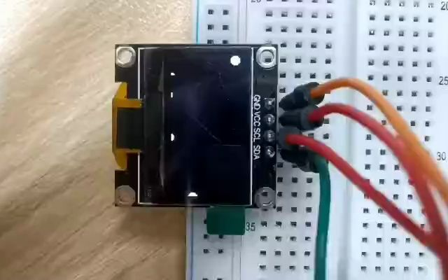

# Projectile Motion Animation On a OLED Display

[Projectile Motion](https://openstax.org/books/physics/pages/5-3-projectile-motion)

A full demo can be found here [Demo](https://www.bilibili.com/video/BV1wx4y197zZ/)

This toy project is developed during learning STM32 programming which turns out to be funny. I am not contributing further efforts to it so just put it here as a zip archive.

# How To Use The Project

It's a Keil MDK5 project. I have stripped off unnecessary components to save (some) space. If you have installed Keil MDK5, you shall open the `animation.uvprojx` with no problem.

# Device Description

## Development Board

A minimal STM32F103C8T6 development board with all GPIO pins. I bought it from Taobao. It looks like this

[STM32F103C8T6最小系统板向下焊接](https://detail.tmall.com/item.htm?abbucket=12&id=535614102774&ns=1&spm=a230r.1.14.11.7df01e9dXupn4X&skuId=5194626899076)
If you plan to buy one online, ask the dealer if they can provide you the board schematics before ordering.

## The OLED Display

[0.96寸OLED显示屏12864液晶屏模块IIC口ssd1306单片机oled12864](https://item.taobao.com/item.htm?spm=a1z10.5-c-s.w4002-23991449502.13.1add2b188hlbJk&id=565003400812)

- A 0.96 inch 128 x 64 OLED display driven by a SSD1306 chip
- 4-pin IIC interface

## Pin Connection

The OLED display has a 4-pin IIC interface

- VCC
- GND
- SCK which is the clock pin
- SDA which is the data pin

So there is only SCK and SDA pins need to be connected to the GPIOs. In my project I connect SCK to GPIO B6, SDA to GPIO B7. You can change the configuration in `Hardware\SSD1306.c`